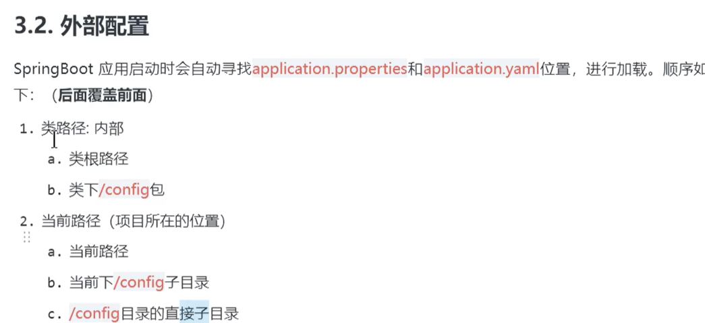
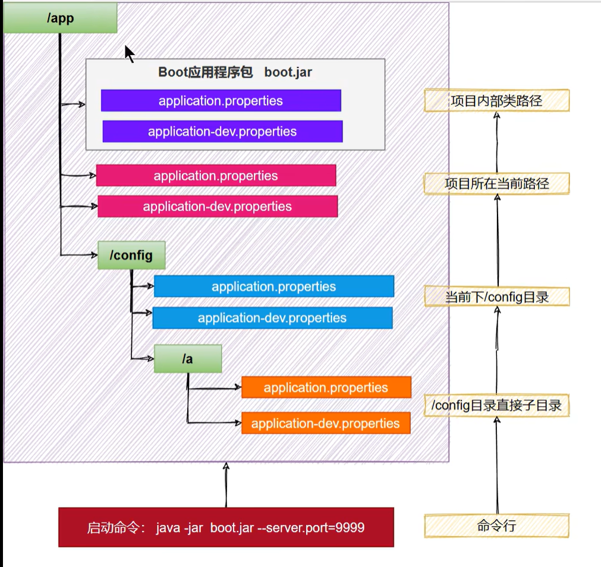
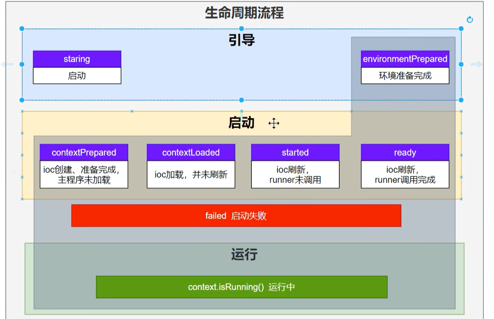

# 外部配置优先级
## application配置文件优先级
1. 命令行参数 > 配置文件(profile > application) > app默认属性
2. 配置文件 : jar包外(profile > application) > jar包内(profile > application) 
3. 
4. 
# 核心原理
## 生命周期监听
1. 生命周期流程

2. 自定义监听事件
   1. `实现SpringApplicationRunListener接口`
   2. 在`META-INF/spring.factories`中配置`org.springframework.boot.SpringApplicationRunListener=自己的监听器`
   3. springboot默认配置了自己的listener
3. 生命周期细节
   1. `DefaultBootstrapContext bootstrapContext = createBootstrapContext();` bootstrapContext引导应用启动
   2. starting() 在 run 方法首次启动时立即调用。可用于非常早期的初始化。
   3. environmentPrepared() 在准备好环境后，但在创建 ApplicationContext 之前调用。
   4. contextPrepared() 在创建并准备 ApplicationContext 之后，但在加载源（主配置类等）之前调用。
   5. contextLoaded() 在加载应用程序上下文后（配置类加载完成）但在刷新应用程序上下文之前（没有加载bean）调用。
   6. started() 上下文已刷新，应用程序已启动，但尚未调用 CommandLineRunners 和 ApplicationRunners。
   7. ready() 在 run 方法完成之前立即调用，此时已刷新应用程序上下文并调用了所有 CommandLineRunners 和 ApplicationRunners。
   8. failed() 如果启动应用程序时遇到异常，则调用。