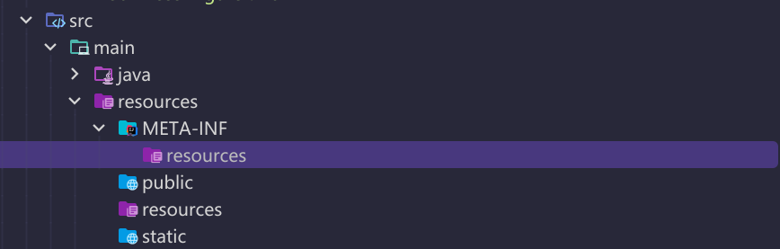
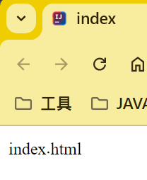

# WebMvcConfigurer
## 生效条件
```java
@AutoConfiguration(after = { DispatcherServletAutoConfiguration.class, TaskExecutionAutoConfiguration.class,
		ValidationAutoConfiguration.class })//在这些配置之后生效
@ConditionalOnWebApplication(type = Type.SERVLET)//web应用生效 type=SERVLET REACTIVE
@ConditionalOnClass({ Servlet.class, DispatcherServlet.class, WebMvcConfigurer.class })
@ConditionalOnMissingBean(WebMvcConfigurationSupport.class)
@AutoConfigureOrder(Ordered.HIGHEST_PRECEDENCE + 10)
@ImportRuntimeHints(WebResourcesRuntimeHints.class)
public class WebMvcAutoConfiguration {
```
## WebMvcAutoConfigurationAdapter
### 效果
```java
// 表单提交Rest请求 默认只有GET,POST，使用此filter,可以提交PUT,DELETE请求
@Bean
@ConditionalOnMissingBean(HiddenHttpMethodFilter.class)
@ConditionalOnProperty(prefix = "spring.mvc.hiddenmethod.filter", name = "enabled")
public OrderedHiddenHttpMethodFilter hiddenHttpMethodFilter() {
    return new OrderedHiddenHttpMethodFilter();
}
// 默认只有GET,POST携带数据，允许PUT,DELETE携带数据
@Bean
@ConditionalOnMissingBean(FormContentFilter.class)
@ConditionalOnProperty(prefix = "spring.mvc.formcontent.filter", name = "enabled", matchIfMissing = true)
public OrderedFormContentFilter formContentFilter() {
    return new OrderedFormContentFilter();
}
```

```java
@Configuration(proxyBeanMethods = false)
@Import(EnableWebMvcConfiguration.class)
@EnableConfigurationProperties({ WebMvcProperties.class, WebProperties.class })
@Order(0)
public static class WebMvcAutoConfigurationAdapter implements WebMvcConfigurer, ServletContextAware {
```
给容器放入`WebMvcConfigurer`可以自己定制SpringMvc各种功能<br>
`WebProperties`绑定配置：`spring.web`
`WebMvcProperties`绑定配置：`spring.mvc`
### WebMvcConfigurer

1. `getMessageCodesResolver`：获取消息代码解析器。用于将错误代码转换为相应的错误消息。
2. `getValidator`：获取验证器。用于验证请求数据是否符合预期的规则。
3. `extendHandlerExceptionResolvers`：扩展异常处理器。用于处理请求处理过程中的异常。
4. `configureHandlerExceptionResolvers`：配置异常处理器。用于配置异常处理器的顺序和处理规则。
5. `extendMessageConverters`：扩展消息转换器。用于将请求数据转换为Java对象，或将Java对象转换为响应数据。
6. `configureMessageConverters`：配置消息转换器。用于配置消息转换器的顺序和处理规则。
7. `addArgumentResolvers`：添加参数解析器。用于解析请求中的参数，并将其转换为Java对象。
8. `addReturnValueHandlers`：添加返回值处理器。用于处理方法返回值，并将其转换为响应数据。
9. `configureViewResolvers`：配置视图解析器。用于将视图名称转换为实际的视图对象。
10. `addViewControllers`：添加视图控制器。用于根据请求路径直接返回视图，而不需要经过Controller层。
11. `addCorsMappings`：添加跨域映射。用于配置跨域请求的处理规则。
12. `addResourceHandlers`：添加资源处理器。用于处理静态资源（如HTML、CSS、JavaScript等）的请求。
13. `addInterceptors`：添加拦截器。用于拦截请求和响应，并对它们进行处理。
14. `addFormatters`：添加格式化器。用于格式化请求和响应数据，例如将字符串转换为日期、数字等。
15. `configureDefaultServletHandling`：配置默认Servlet处理。用于处理无法匹配任何Controller的请求。
16. `configureAsyncSupport`：配置异步支持。用于配置异步请求的处理规则。
17. `configureContentNegotiation`：配置内容协商。用于根据请求的Accept头确定要返回的响应内容类型。
18. `configurePathMatch`：配置路径匹配。用于配置路径匹配规则，例如是否启用路径参数的通配符匹配。

### 静态资源

```java
@Override
public void addResourceHandlers(ResourceHandlerRegistry registry) {
    // addMappings默认为true
    if (!this.resourceProperties.isAddMappings()) {
        logger.debug("Default resource handling disabled");
        return;
    }
    // 当以`private String webjarsPathPattern = "/webjars/**"`请求时 将进入classpath:/META-INF/resources/webjars/ 寻找资源（this.mvcProperties.getWebjarsPathPattern()）
    // 导入webjar依赖 请求路径 == 进入webjar类路径访问资源
    addResourceHandler(registry, this.mvcProperties.getWebjarsPathPattern(),
    "classpath:/META-INF/resources/webjars/");
    // 当以`private String staticPathPattern = "/**";`请求时 将进入四个类路径寻找资源（this.mvcProperties.getStaticPathPattern())
    /*  
   this.resourceProperties.getStaticLocations()
   
   private static final String[] CLASSPATH_RESOURCE_LOCATIONS = {
    "classpath:/META-INF/resources/",
    "classpath:/resources/",
    "classpath:/static/",
    "classpath:/public/" };
    
    private String[] staticLocations = CLASSPATH_RESOURCE_LOCATIONS; 
    */
    addResourceHandler(registry, this.mvcProperties.getStaticPathPattern(), (registration) -> {
        registration.addResourceLocations(this.resourceProperties.getStaticLocations());
        if (this.servletContext != null) {
            ServletContextResource resource = new ServletContextResource(this.servletContext, SERVLET_LOCATION);
            registration.addResourceLocations(resource);
        }
    });
}
```
1. `this.mvcProperties.getWebjarsPathPattern()`：mvcProperties属于WebMvcProperties类
    `@ConfigurationProperties(prefix = "spring.mvc")
    public class WebMvcProperties {` 该类属性绑定配置文件spring.mvc,其中设置静态资源访问路径，webjars访问路径
2. `this.resourceProperties.getStaticLocations()`：该类除了可以设置缓存策略外，还在这里设置静态资源路径，设置private boolean addMappings = true;
```java
private void addResourceHandler(ResourceHandlerRegistry registry, String pattern, Consumer<ResourceHandlerRegistration> customizer) {
if (registry.hasMappingForPattern(pattern)) {
return;
}
ResourceHandlerRegistration registration = registry.addResourceHandler(pattern);
customizer.accept(registration);
    /* 
    1.this.resourceProperties:
    在WebMvcAutoConfiguration中：
    2.private final Resources resourceProperties;
    Resources属于配置类：
    @ConfigurationProperties("spring.web")
    public class WebProperties { 
    由此在spring.web配置文件进行缓存策略配置
    */
    // 设置缓存生命周期 默认 0 
    registration.setCachePeriod(getSeconds(this.resourceProperties.getCache().getPeriod()));
    // HTTP缓存控制（前端）
    registration.setCacheControl(this.resourceProperties.getCache().getCachecontrol().toHttpCacheControl());
    // 最后一次修改 如果浏览器缓存资源last time != 服务器资源 last time 则重新获取资源 否则使用缓存资源 减少向服务器的请求
    registration.setUseLastModified(this.resourceProperties.getCache().isUseLastModified());
    customizeResourceHandlerRegistration(registration);
}
```
```properties
# 设置资源缓存周期 单位：s
spring.web.resources.cache.period=3600
# 更详细的缓存策略控制 设置此属性，将重写spring.web.resources.cache.period
spring.web.resources.cache.cachecontrol.max-age=7200
# 设置是否开启最新修改时间
spring.web.resources.cache.use-last-modified=true
```
## EnableWebMvcConfiguration
### 欢迎页
1. 当没有`WebMvcConfigurationSupport`时组件生效 生效之后 developer自己可以使用`WebMvcConfigurationSupport`
```java
@ConditionalOnMissingBean(WebMvcConfigurationSupport.class)

public static class EnableWebMvcConfiguration extends DelegatingWebMvcConfiguration implements ResourceLoaderAware { 
    
public class DelegatingWebMvcConfiguration extends WebMvcConfigurationSupport {
}
```
2. `welcomePageHandlerMapping`找到对应的handler方法 
```java
@Bean
public WelcomePageHandlerMapping welcomePageHandlerMapping(ApplicationContext applicationContext, FormattingConversionService mvcConversionService, ResourceUrlProvider mvcResourceUrlProvider) {
    // 返回欢迎页
    return createWelcomePageHandlerMapping(applicationContext, mvcConversionService, mvcResourceUrlProvider, WelcomePageHandlerMapping::new);
}
```
```java
private <T extends AbstractUrlHandlerMapping> T createWelcomePageHandlerMapping(ApplicationContext applicationContext, FormattingConversionService mvcConversionService, ResourceUrlProvider mvcResourceUrlProvider, WelcomePageHandlerMappingFactory<T> factory) {TemplateAvailabilityProviders templateAvailabilityProviders = new TemplateAvailabilityProviders(applicationContext);
    // 根据private String staticPathPattern = "/** 获取静态资源
    String staticPathPattern = this.mvcProperties.getStaticPathPattern();
    // 获取html欢迎页 getIndexHtmlResource()
    T handlerMapping = factory.create(templateAvailabilityProviders, applicationContext, getIndexHtmlResource(), staticPathPattern);
    
    handlerMapping.setInterceptors(getInterceptors(mvcConversionService, mvcResourceUrlProvider));
    
    handlerMapping.setCorsConfigurations(getCorsConfigurations());
    
    return handlerMapping;
}
```
```java
private Resource getIndexHtmlResource() {
    for (String location : this.resourceProperties.getStaticLocations()) {
        /* 根据 
        1. classpath:/META-INF/resources/
        2.classpath:/resources/
        3.classpath:/static/
        4.classpath:/public/ 遍历获取Resource欢迎页 */
        
        Resource indexHtml = getIndexHtmlResource(location);
        if (indexHtml != null) {
            return indexHtml;
        }
    }
    ServletContext servletContext = getServletContext();
    if (servletContext != null) {
        return getIndexHtmlResource(new ServletContextResource(servletContext, SERVLET_LOCATION));
    }
    return null;
}
// 调用
private Resource getIndexHtmlResource(String location) {
    return getIndexHtmlResource(this.resourceLoader.getResource(location));
}

private Resource getIndexHtmlResource(Resource location) {
    try {
        // 获取欢迎页index.html 浏览器默认寻找此资源加载
        Resource resource = location.createRelative("index.html");
        if (resource.exists() && (resource.getURL() != null)) {
            return resource;
        }
    }
    catch (Exception ex) {
        // Ignore
    }
    return null;
}
```
3. favicon.ico browser默认规则 访问index.html会请求favicon.ico资源加载 和springboot没有太大关系<br>

4. 为什么使用bean组件也能实现自定义配置？
   1. EnableWebMvcConfiguration继承了DelegatingWebMvcConfiguration
   ```java
    @Configuration(proxyBeanMethods = false)
    @EnableConfigurationProperties(WebProperties.class)
    public static class EnableWebMvcConfiguration extends DelegatingWebMvcConfiguration  implements ResourceLoaderAware {
    ```
   2. DelegatingWebMvcConfiguration中：
    ```java
    public class DelegatingWebMvcConfiguration extends WebMvcConfigurationSupport {
    private final WebMvcConfigurerComposite configurers = new WebMvcConfigurerComposite();

    public DelegatingWebMvcConfiguration() {
    }
    // 自动注入容器所有的configurers 其中包含有自定义配置组件bean 
    @Autowired(
        required = false
    )
    public void setConfigurers(List<WebMvcConfigurer> configurers) {
        if (!CollectionUtils.isEmpty(configurers)) {
            this.configurers.addWebMvcConfigurers(configurers);
        }
    }
    ```
   3. `class WebMvcConfigurerComposite implements WebMvcConfigurer {` WebMvcConfigurerComposite中重写了所有WebMvcConfigurer方法 当bean调用自定义方法时 会调用这里的方法实现自定义配置

## 内容协商
### 动态返回请求的格式数据
#### 根据请求头
1. 返回json 设置请求头Accept:application/json
   1. `spring-boot-starter-web`默认引入依赖`spring-boot-starter-json`,`spring-boot-starter-json`包含依赖`jackson-databind`包含依赖`jackson-core`,jackson-core底层默认处理数据返回json
2. 返回xml 设置请求头Accept:application/xml
   1. 导入依赖
   ```xml
   <dependency>
     <groupId>com.fasterxml.jackson.dataformat</groupId>
        <artifactId>jackson-dataformat-xml</artifactId>
   </dependency>
   ```
   2. 实体类添加注解`@JacksonXmlRootElement`
### 根据请求参数
1. 配置文件
   ```properties
     # 配置请求参数
     spring.mvc.contentnegotiation.favor-parameter=true
     # 配置请求参数自定义名 默认是format
     spring.mvc.contentnegotiation.parameter-name=type
   ```
2. 请求参数
   1. json:http://localhost:8080/person?type=json
   2. xml:http://localhost:8080/person?type=xml

## 错误处理机制
### 前后端分离 

1. 只处理单类所有方法的异常
   1. 使用注解 `@ExceptionHandler(Exception.class) @ResponseBody`
   ```java
    @ExceptionHandler(Exception.class)
    @ResponseBody
    public String handleException(Exception e){
        return "单类级异常处理" + e.getMessage ();
    }
   ```
   
2. 处理所有异常
   1. 全局异常处理包`exception`
   2. 自定义全局处理异常类
   ```java
    package com.fengxin.springboot.bootweb.exception;

      import org.springframework.web.bind.annotation.ExceptionHandler;
      import org.springframework.web.bind.annotation.ResponseBody;
      import org.springframework.web.bind.annotation.RestControllerAdvice;
   /**
     * @author FENGXIN
     * @date 2024/8/27
     * @project springboot-part
     * @description
   **/
   // 添加注解 @RestControllerAdvice 或者 @ControllerAdvice
       @RestControllerAdvice
       public class GlobalHandleException {
         // 异常逻辑
          @ExceptionHandler(Exception.class)
          @ResponseBody
          public String exception(Exception e){
          return "全局异常处理" + e.getMessage ();
          }
       }
     ```
   
### 前后端不分离

1. `BasicErrorController.java`中
```java
// 返回html
@RequestMapping(produces = MediaType.TEXT_HTML_VALUE)
 public ModelAndView errorHtml(HttpServletRequest request, HttpServletResponse response) {
    // 获取状态码
     HttpStatus status = getStatus(request);
     Map<String, Object> model = Collections
         .unmodifiableMap(getErrorAttributes(request, getErrorAttributeOptions(request, MediaType.TEXT_HTML)));
     response.setStatus(status.value());
     // 根据状态码获取页面
     ModelAndView modelAndView = resolveErrorView(request, response, status, model);
     // 如果没有读取到 返回默认页面 classpath:template/error
     return (modelAndView != null) ? modelAndView : new ModelAndView("error", model);
 }
// 返回json
 @RequestMapping
 public ResponseEntity<Map<String, Object>> error(HttpServletRequest request) {
     HttpStatus status = getStatus(request);
     if (status == HttpStatus.NO_CONTENT) {
         return new ResponseEntity<>(status);
     }
     Map<String, Object> body = getErrorAttributes(request, getErrorAttributeOptions(request, MediaType.ALL));
     return new ResponseEntity<>(body, status);
 }
```
2. `resolveErrorView(request, response, status, model);`
```java
protected ModelAndView resolveErrorView(HttpServletRequest request, HttpServletResponse response, HttpStatus status,
                                     Map<String, Object> model) {
    // errorViewResolvers 容器中会放入DefaultErrorViewResolvers组件
for (ErrorViewResolver resolver : this.errorViewResolvers) {
   ModelAndView modelAndView = resolver.resolveErrorView(request, status, model);
   if (modelAndView != null) {
      return modelAndView;
   }
}
return null;
}
```
3. `resolver.resolveErrorView(request, status, model);`
```java
// 模糊码 类加载时存在
private static final Map<Series, String> SERIES_VIEWS;
 static {
     Map<Series, String> views = new EnumMap<>(Series.class);
     views.put(Series.CLIENT_ERROR, "4xx");
     views.put(Series.SERVER_ERROR, "5xx");
     SERIES_VIEWS = Collections.unmodifiableMap(views);
 }
```
```java
@Override
 public ModelAndView resolveErrorView(HttpServletRequest request, HttpStatus status, Map<String, Object> model) {
    // 调用方法resolve
     ModelAndView modelAndView = resolve(String.valueOf(status.value()), model);
     if (modelAndView == null && SERIES_VIEWS.containsKey(status.series())) {
         modelAndView = resolve(SERIES_VIEWS.get(status.series()), model);
     }
     return modelAndView;
 }
 // 精确码匹配路径 classpath:templates/error/精确码.html
 private ModelAndView resolve(String viewName, Map<String, Object> model) {
     String errorViewName = "error/" + viewName;
     TemplateAvailabilityProvider provider = this.templateAvailabilityProviders.getProvider(errorViewName,
             this.applicationContext);
     if (provider != null) {
         return new ModelAndView(errorViewName, model);
     }
     // 如果没有 匹配模糊码
     return resolveResource(errorViewName, model);
 }
 // 匹配模糊码 classpath:templates/error/模糊码.html
 private ModelAndView resolveResource(String viewName, Map<String, Object> model) {
     for (String location : this.resources.getStaticLocations()) {
         try {
             Resource resource = this.applicationContext.getResource(location);
             resource = resource.createRelative(viewName + ".html");
             if (resource.exists()) {
                 return new ModelAndView(new HtmlResourceView(resource), model);
             }
         }
         catch (Exception ex) {
             // Ignore
         }
     }
     return null;
 }
```
## 嵌入式容器
1. web starter 导入了 tomcat starter
2. `ServletWebServerFactoryAutoConfiguration` 中
   ```java
   @AutoConfiguration(after = SslAutoConfiguration.class)
   @AutoConfigureOrder(Ordered.HIGHEST_PRECEDENCE)
   // 导入了servlet才生效
   @ConditionalOnClass(ServletRequest.class)
   @ConditionalOnWebApplication(type = Type.SERVLET)
   // 属性绑定 @ConfigurationProperties(prefix = "server", ignoreUnknownFields = true) public class ServerProperties {
   @EnableConfigurationProperties(ServerProperties.class)
   // 引入web服务器
   @Import({ ServletWebServerFactoryAutoConfiguration.BeanPostProcessorsRegistrar.class,
   ServletWebServerFactoryConfiguration.EmbeddedTomcat.class,
   ServletWebServerFactoryConfiguration.EmbeddedJetty.class,
   ServletWebServerFactoryConfiguration.EmbeddedUndertow.class })
   public class ServletWebServerFactoryAutoConfiguration {
   ```
3. `ServletWebServerFactoryConfiguration` 嵌入式容器
   ```java
   @Configuration(proxyBeanMethods = false)
   @ConditionalOnClass({ Servlet.class, Tomcat.class, UpgradeProtocol.class })
   @ConditionalOnMissingBean(value = ServletWebServerFactory.class, search = SearchStrategy.CURRENT)
   static class EmbeddedTomcat {
   
        @Bean
        TomcatServletWebServerFactory tomcatServletWebServerFactory(
                ObjectProvider<TomcatConnectorCustomizer> connectorCustomizers,
                ObjectProvider<TomcatContextCustomizer> contextCustomizers,
                ObjectProvider<TomcatProtocolHandlerCustomizer<?>> protocolHandlerCustomizers) {
            // 创建服务器
            TomcatServletWebServerFactory factory = new TomcatServletWebServerFactory();
            factory.getTomcatConnectorCustomizers().addAll(connectorCustomizers.orderedStream().toList());
            factory.getTomcatContextCustomizers().addAll(contextCustomizers.orderedStream().toList());
            factory.getTomcatProtocolHandlerCustomizers().addAll(protocolHandlerCustomizers.orderedStream().toList());
            return factory;
        }
   
    }
   
    /**
     * Nested configuration if Jetty is being used.
     */
    @Configuration(proxyBeanMethods = false)
    @ConditionalOnClass({ Servlet.class, Server.class, Loader.class, WebAppContext.class })
    @ConditionalOnMissingBean(value = ServletWebServerFactory.class, search = SearchStrategy.CURRENT)
    static class EmbeddedJetty {
   
        @Bean
        JettyServletWebServerFactory jettyServletWebServerFactory(
                ObjectProvider<JettyServerCustomizer> serverCustomizers) {
            JettyServletWebServerFactory factory = new JettyServletWebServerFactory();
            factory.getServerCustomizers().addAll(serverCustomizers.orderedStream().toList());
            return factory;
        }
   
    }
   
    /**
     * Nested configuration if Undertow is being used.
     */
    @Configuration(proxyBeanMethods = false)
    @ConditionalOnClass({ Servlet.class, Undertow.class, SslClientAuthMode.class })
    @ConditionalOnMissingBean(value = ServletWebServerFactory.class, search = SearchStrategy.CURRENT)
    static class EmbeddedUndertow {
   
        @Bean
        UndertowServletWebServerFactory undertowServletWebServerFactory(
                ObjectProvider<UndertowDeploymentInfoCustomizer> deploymentInfoCustomizers,
                ObjectProvider<UndertowBuilderCustomizer> builderCustomizers) {
            UndertowServletWebServerFactory factory = new UndertowServletWebServerFactory();
            factory.getDeploymentInfoCustomizers().addAll(deploymentInfoCustomizers.orderedStream().toList());
            factory.getBuilderCustomizers().addAll(builderCustomizers.orderedStream().toList());
            return factory;
        }
   
        @Bean
        UndertowServletWebServerFactoryCustomizer undertowServletWebServerFactoryCustomizer(
                ServerProperties serverProperties) {
            return new UndertowServletWebServerFactoryCustomizer(serverProperties);
        }
   
    }
   ```
4. `TomcatServletWebServerFactory` 创建tomcat 其他服务器类似 `getWebServer`获取web服务器 并进行属性配置
   ```java
      @Override
      public WebServer getWebServer(ServletContextInitializer... initializers) {
        if (this.disableMBeanRegistry) {
            Registry.disableRegistry();
        }
        Tomcat tomcat = new Tomcat();
        File baseDir = (this.baseDirectory != null) ? this.baseDirectory : createTempDir("tomcat");
        tomcat.setBaseDir(baseDir.getAbsolutePath());
        for (LifecycleListener listener : this.serverLifecycleListeners) {
            tomcat.getServer().addLifecycleListener(listener);
        }
        Connector connector = new Connector(this.protocol);
        connector.setThrowOnFailure(true);
        tomcat.getService().addConnector(connector);
        customizeConnector(connector);
        tomcat.setConnector(connector);
        registerConnectorExecutor(tomcat, connector);
        tomcat.getHost().setAutoDeploy(false);
        configureEngine(tomcat.getEngine());
        for (Connector additionalConnector : this.additionalTomcatConnectors) {
            tomcat.getService().addConnector(additionalConnector);
            registerConnectorExecutor(tomcat, additionalConnector);
        }
        prepareContext(tomcat.getHost(), initializers);
        return getTomcatWebServer(tomcat);
      }
   ```
5. `getWebServer`在哪里调用？重写在哪里？==> `ServletWebServerApplicationContext` ioc容器创建webserver
   ```java
   // ServletWebServerApplicationContext中
   private void createWebServer() {
        WebServer webServer = this.webServer;
        ServletContext servletContext = getServletContext();
        if (webServer == null && servletContext == null) {
            StartupStep createWebServer = getApplicationStartup().start("spring.boot.webserver.create");
            ServletWebServerFactory factory = getWebServerFactory();
            createWebServer.tag("factory", factory.getClass().toString());
            //调用getWebServer
            this.webServer = factory.getWebServer(getSelfInitializer());
            createWebServer.end();
            getBeanFactory().registerSingleton("webServerGracefulShutdown",
                    new WebServerGracefulShutdownLifecycle(this.webServer));
            getBeanFactory().registerSingleton("webServerStartStop",
                    new WebServerStartStopLifecycle(this, this.webServer));
        }
        else if (servletContext != null) {
            try {
                getSelfInitializer().onStartup(servletContext);
            }
            catch (ServletException ex) {
                throw new ApplicationContextException("Cannot initialize servlet context", ex);
            }
        }
        initPropertySources();
    }
   ```
   2. 在ServletWebServerApplicationContext中 `onRefresh`时会创建服务器 
   ```java
   @Override
   protected void onRefresh() {
    super.onRefresh();
    try {createWebServer();
    } catch (Throwable ex) {
        throw new ApplicationContextException("Unable to start web server", ex);
    }
   }
   ```
   3. `onRefresh`何时调用？在创建容器的时候 12步骤
   ```java
   @Override
    public void refresh() throws BeansException, IllegalStateException {
        this.startupShutdownLock.lock();
        try {
            this.startupShutdownThread = Thread.currentThread();
   
            StartupStep contextRefresh = this.applicationStartup.start("spring.context.refresh");
   
            // Prepare this context for refreshing.
            prepareRefresh();
   
            // Tell the subclass to refresh the internal bean factory.
            ConfigurableListableBeanFactory beanFactory = obtainFreshBeanFactory();
   
            // Prepare the bean factory for use in this context.
            prepareBeanFactory(beanFactory);
   
            try {
                // Allows post-processing of the bean factory in context subclasses.
                postProcessBeanFactory(beanFactory);
   
                StartupStep beanPostProcess = this.applicationStartup.start("spring.context.beans.post-process");
                // Invoke factory processors registered as beans in the context.
                invokeBeanFactoryPostProcessors(beanFactory);
                // Register bean processors that intercept bean creation.
                registerBeanPostProcessors(beanFactory);
                beanPostProcess.end();
   
                // Initialize message source for this context.
                initMessageSource();
   
                // Initialize event multicaster for this context.
                initApplicationEventMulticaster();
   
                // Initialize other special beans in specific context subclasses.
                onRefresh();
   
                // Check for listener beans and register them.
                registerListeners();
   
                // Instantiate all remaining (non-lazy-init) singletons.
                finishBeanFactoryInitialization(beanFactory);
   
                // Last step: publish corresponding event.
                finishRefresh();
            }
   
            catch (RuntimeException | Error ex ) {
                if (logger.isWarnEnabled()) {
                    logger.warn("Exception encountered during context initialization - " +
                            "cancelling refresh attempt: " + ex);
                }
   
                // Destroy already created singletons to avoid dangling resources.
                destroyBeans();
   
                // Reset 'active' flag.
                cancelRefresh(ex);
   
                // Propagate exception to caller.
                throw ex;
            }
   
            finally {
                contextRefresh.end();
            }
        }
        finally {
            this.startupShutdownThread = null;
            this.startupShutdownLock.unlock();
   }
   }
   ```
   
## 全面接管springmvc
### 请求上下文过滤器 `RequestContextFilter`
1. 封装请求和响应
   ```java
   // WebMvcAutoConfigurationAdapter
   @Bean
   @ConditionalOnMissingBean({ RequestContextListener.class, RequestContextFilter.class })
   @ConditionalOnMissingFilterBean(RequestContextFilter.class)
   public static RequestContextFilter requestContextFilter() {
      return new OrderedRequestContextFilter();
   }
   ```
   ```java
   // RequestContextFilter
   @Override
    protected void doFilterInternal(
            HttpServletRequest request, HttpServletResponse response, FilterChain filterChain)
            throws ServletException, IOException {
        // 将request response 包装到ServletRequestAttributes实例 在后续任意位置都可以通过该类实例获取请求和响应
        // 2.再转换成包装实例
        ServletRequestAttributes attributes = new ServletRequestAttributes(request, response);
        // 初始化 封装保存当前一对请求和响应
        initContextHolders(request, attributes);
   
        try {
            filterChain.doFilter(request, response);
        }
        finally {
            resetContextHolders();
            if (logger.isTraceEnabled()) {
                logger.trace("Cleared thread-bound request context: " + request);
            }
            attributes.requestCompleted();
        }
    }
   ```
   ```java
   private void initContextHolders(HttpServletRequest request, ServletRequestAttributes requestAttributes) {
        LocaleContextHolder.setLocale(request.getLocale(), this.threadContextInheritable);
        // 保存 1.先从保存体获取attributes 
        RequestContextHolder.setRequestAttributes(requestAttributes, this.threadContextInheritable);
        if (logger.isTraceEnabled()) {
            logger.trace("Bound request context to thread: " + request);
        }
    }
   ```
   
### `@EnableWebMvc` 注解实现禁用boot提供的默认配置
1. `@EnableWebMvc`
   ```java
   @Retention(RetentionPolicy.RUNTIME)
   @Target({ElementType.TYPE})
   @Documented
   // 引入该类
   @Import({DelegatingWebMvcConfiguration.class})
   public @interface EnableWebMvc {
   }
   ```
   
2. `DelegatingWebMvcConfiguration` 继承自 `WebMvcConfigurationSupport`
   ```java
   public class DelegatingWebMvcConfiguration extends WebMvcConfigurationSupport {
   ```
   
3. `在WebMvcAutoConfiguration`中有条件注解`@ConditionalOnMissingBean(WebMvcConfigurationSupport.class)` 这就是禁用原因